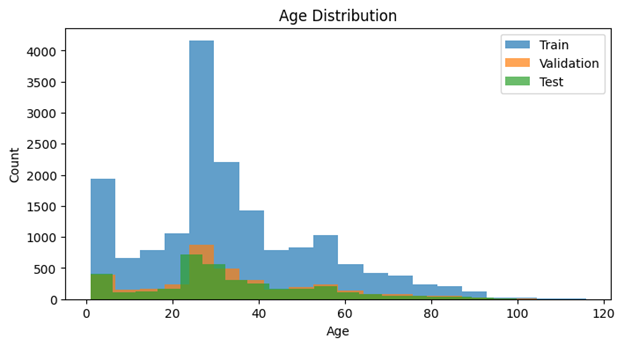
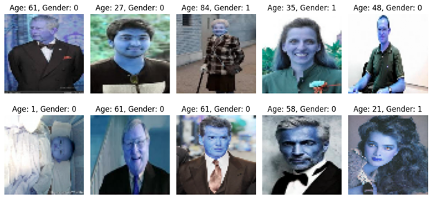
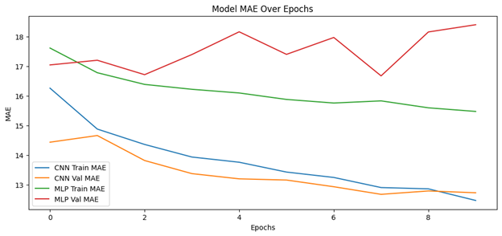

# UTKFace Dataset Analysis and Prediction
This repository demonstrates an end-to-end machine learning workflow for predicting age, gender, and ethnicity from the UTKFace dataset using deep learning models in TensorFlow/Keras.

---

## Dataset
The dataset used is the **UTKFace Dataset**, which consists of images of faces labeled with attributes such as:
- **Age** (integer, 0–116),
- **Gender** (0: Male, 1: Female),
- **Ethnicity** (0: White, 1: Black, 2: Asian, 3: Indian, 4: Other).

You can download the dataset [here](https://susanqq.github.io/UTKFace/).

---

## Project Workflow
1. **Data Loading and Preprocessing**  
   - Images are resized to `64x64` pixels.
   - Pixel values are normalized to `[0, 1]`.
   - The file name is parsed to extract labels for age, gender, and ethnicity.

2. **Exploratory Data Analysis (EDA)**  
   - Histograms for age distribution.
   - Random samples of images with age and gender displayed.

3. **Model Architecture**  
   - **Convolutional Neural Network (CNN):** Used for regression (age prediction).
   - **Multi-Layer Perceptron (MLP):** Another approach for regression to compare performance.

4. **Training and Validation**  
   - Data is split into training, validation, and test sets.
   - Loss function: Mean Squared Error (MSE).
   - Metrics: Mean Absolute Error (MAE).

5. **Evaluation and Visualization**  
   - Confusion matrix for gender classification.
   - Plotting MAE for both CNN and MLP models over epochs.

---

## Requirements
- Python 3.7+
- TensorFlow/Keras
- OpenCV
- Matplotlib
- NumPy
- Scikit-learn
- Seaborn

Install dependencies:
```bash
pip install tensorflow opencv-python matplotlib numpy scikit-learn seaborn
```

---

## Usage

1. **Download the Dataset**
   - Download and extract the dataset from the [UTKFace website](https://susanqq.github.io/UTKFace/).
   - Set the `DATASET_PATH` in the code to the folder containing the images.

2. **Run the Script**
   - Execute the script to preprocess the dataset, train models, and evaluate their performance:
   ```bash
   python utkface_image_model_training.ipynb
   ```

3. **Outputs**
   - Training/validation/test set sizes.
   - Age distribution histograms.
   - Sample image visualizations.
   - Training metrics (loss and MAE).
   - Confusion matrix for gender classification.

---

## Results
- **CNN Performance (Age Prediction):**
  - Test Loss: `X`
  - Test MAE: `Y`

- **MLP Performance (Age Prediction):**
  - Test Loss: `X`
  - Test MAE: `Y`

---

## Visualization
- **Age Distribution:**
  Displays the distribution of ages in training, validation, and test sets.  
  

- **Sample Images:**  
  Displays random samples from the dataset with labels.  
  

- **Model Performance:**  
  Training and validation MAE over epochs for CNN and MLP models.  
  

---

## Troubleshooting
- Skipped files with invalid formats are logged in the console.
- Ensure the dataset is correctly named and follows the expected filename format: `{age}_{gender}_{ethnicity}_other.jpg`.

---

## Future Improvements
- Incorporate multi-task learning for joint age, gender, and ethnicity prediction.
- Apply transfer learning using a pre-trained model like ResNet.
- Explore additional data augmentation techniques to improve model generalization.

---

## Acknowledgments
- **UTKFace Dataset**: [https://susanqq.github.io/UTKFace/](https://susanqq.github.io/UTKFace/)
- TensorFlow/Keras Documentation: [https://www.tensorflow.org](https://www.tensorflow.org)
